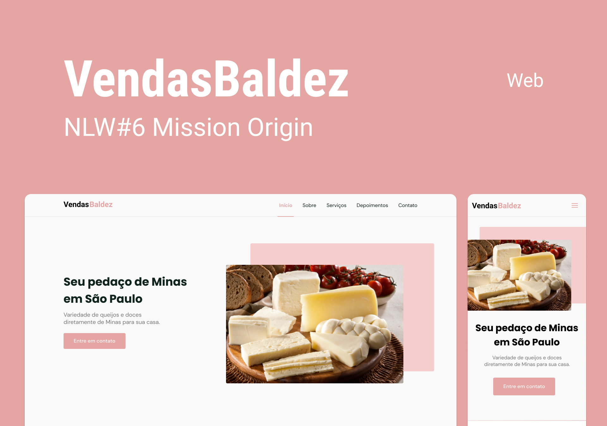

<h1 align="center"> VendasBaldez </h1>

  

## :arrow_right: Você pode acessar [Clicando aqui](https://juliabb.github.io/vendasbaldez/)
VendasBaldez foi desenvolvido no NLW - Origin da [Rocketseat](https://github.com/rocketseat-education/nlw-06-origin)
## 🚀 Tecnologias

Esse projeto foi desenvolvido com as seguintes tecnologias:

- HTML
- CSS
- JavaScript

Bibliotecas

- [Google Fonts](https://fonts.google.com/)
- [SwipeJS](https://github.com/nolimits4web/Swiper)
- [ScrollRevel](https://scrollrevealjs.org)

Utilitários

- [Pexels](https://www.pexels.com/pt-br/)
- [IconMoon](https://icomoon.io/app/#/select)

## 💻 Projeto

VendasBaldez é uma página institucional no formato One Page, responsiva, para usar em diversos tipos de micro, pequena e média empresas. Contém as seguintes seções: Header, Navigation, Home, Sobre, Serviços, Depoimentos, Contato e Footer

## 🔖 Layout

Você pode visualizar o layout do projeto através [desse link](https://www.figma.com/file/nG0weKk8Vdcy8NUOOj6BdK/Vendas-Baldez?node-id=0%3A1). É necessário ter conta no [Figma](https://figma.com) para acessá-lo.

## 📝 Licença

Esse projeto está sob a licença MIT. Veja o arquivo [LICENSE](https://github.com/rocketseat-education/nlw-06-origin/blob/main/.github/LICENSE.md) para mais detalhes.

---

Feito com :purple_heart: by Julia Benedicto  

